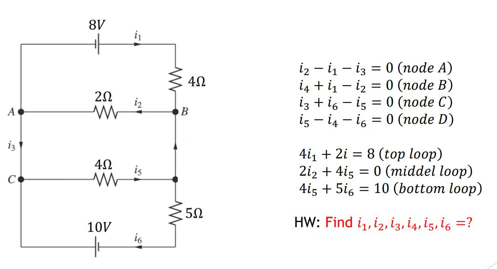

這是我修計算機課程的作業，總共有 11 個作業以及 1 個期末專案。下面將說明程式碼的內容。

# HW1.1 NumPy 陣列操作

這個程式使用 NumPy 陣列的基本操作，包括陣列創建、重塑、計算每行總和和矩陣更新。

1. 導入 NumPy 模組:

```python
import numpy as np
```

2. 創建和重塑陣列 a:

```python
a = np.arange(1, 26, 1)
print(a)
print("\n")
a = np.reshape(a, (5, 5))
print(a)
print("\n")
```

`np.arange(1, 26, 1)` 創建包含從 1 到 25 的陣列 a。
`np.reshape(a, (5, 5))` 將 a 重新塑形為一個 5x5 的矩陣並打印出來。

3. 計算每行的總和:

```python
for i in range(0, 4):
    b = sum(a[i, :])
    print("ro", i, "sum=", b)
print("\n")
```

`for` 迴圈遍歷每一行（索引從 `0` 到 `3`）。
`sum(a[i, :])`計算第 i 行的總和並打印出來。

4. 更新矩陣:

```python
a[2] = a[0, :] + a[2, :]
print("new matrix=\n")
print(a)
```

## 結果

這個程式展示了使用 NumPy 的基本陣列操作，包括創建陣列、重塑、計算每行總和和原地更新。

# HW1.2 Gaussian Elimination with Python and NumPy


這段程式碼是用來解決一個線性電路的節點電壓問題，使用 Python 和 NumPy 來實現高斯消去法，並使用矩陣的逆來解線性方程組，計算各個支路的電流。

## 程式碼解釋

1. 導入必要的模組：

```python
import numpy as np
from numpy.linalg import inv
```

2. 創建矩陣 `A` 和向量 `b`：

```python
A = np.array([[-1, 1, -1, 0, 0, 0],  #A
                    [4, 2, 0, 0, 0, 0],   #top
                    [1, -1, 0, 1, 0, 0],  #B
                    [0, 0, 1, 0, -1, 1],  #c
                    [0, 2, 0, 0, 4, 0],   #middel
                    [0, 0, 0, 0, 4, 5],   #bottom
                    [0, 0, 0, -1, 1, -1]])#D

b = np.array([[0],  #A
              [8],  #top
              [0],  #B
              [0],  #C
              [0],  #middel
              [10], #bottom
              [0]]) #D
```

3. 定義矩陣的大小：

```python
n = 6
```

4. 高斯消去法 (Gaussian Elimination)：

消元過程：

```python
for i in range(0, n-1):
for j in range(i + 1, n+1):
if A[j, i] != 0.0:
lam = A[j, i] / A[i, i]
A[j, i : n] = A[j, i : n] - lam _ A[i, i : n]
b[j] = b[j] - lam _ b[i]
```

對每一列，將其下方列的元素消去。

5. 打印中間結果：

```python
print("Gaussian Elimination")
print("=========================")
print("orignal")
print("-------------------------")
print(" A =\n",A)
print("b =\n", b)
print("=========================")
print("modify")
print("-------------------------")
A = A[0 : n,0 : n]
b = b[0 : n]
print("A =\n",A)
print("b =\n", b)
```

6. 回代過程 (Back Substitution)：

   初始化解向量：

```python
x = np.zeros((6, 1))
```

7. 計算最後一個變量：

```python
x[n-1] = b[n-1] / A[n-1, n-1]
```

8. 從倒數第二行開始反向計算其餘變量：

```python
for i in range(n-2, -1, -1):
x[i] = (b[i] - np.dot(A[i, i + 1 : n], x[i + 1 : n])) / A[i, i]
print("x =\n",x)
```

9. 使用矩陣的逆來解方程組：

   計算矩陣的逆並解方程：

```python
print("=========================")
print("inverse")
x = np.dot(inv(A), b)
print("x =\n",x)
```

## 結果說明

這段程式碼首先使用高斯消去法進行消元，然後使用回代過程計算未知數的值，最後使用矩陣的逆來檢查解的正確性。結果顯示了不同步驟的中間值和最終解。

# HW2.2

這段程式碼演示了如何使用 Python 中的 NumPy 和 Matplotlib 庫來模擬和分析一個動態系統的行為。讓我們來分析它的具體內容：

## 程式碼解析

1. 導入模組

```python
import numpy as np
import matplotlib.pyplot as plt
```

這裡導入了 NumPy 用於數值計算和 Matplotlib 用於繪圖的模組。

2. 設定參數

```python
N = 51
h = 10 / (N-1)
```

定義了數據點數量 N 和步長 h，用於數值微分。

3. 生成時間或空間點集

```python
x = np.zeros(51)
a = 0
for i in range (51):
    x[i] = a
    a += 0.2
print("x", x)
```

這裡生成了一個包含 51 個等間距點的數組 x，用來表示時間或空間中的點。

4. 系統動態描述

```python
v = 1 - np.exp(-x)
print("v:\n", v)
```

這段程式碼計算了系統中某個物理量 v 隨時間或空間的變化。這裡使用了指數衰減函數來模擬系統的動態行為。

5. 數值微分計算

```python

dv = np.zeros((N), dtype=float)
for i in range(1, N-2):
    dv[i] = (v[i + 1] - v[i - 1]) / (2 * h)
print("dv:\n", dv)
```

使用了三點差分公式來計算 v 的數值導數 dv。這裡假設 dv 是某物理量的變化率。

6. 繪圖展示

```python
fig, ax = plt.subplots()
ax.set_title('dVy / d$\\tau$ = 1 - Vy : three-point formula')
plt.xlabel('t')
plt.ylabel('$V_t$')
ax.plot(x[1 : N-2], v[1 : N-2], 'r-', label='ana.')
ax.plot(x[2 : N-2], 1 - dv[2 : N-2], 'bs', label='num.')
ax.legend(loc='lower right')
plt.show()
```

這段程式碼使用 Matplotlib 來繪製圖形，以直觀地展示分析和數值結果。其中，紅色曲線顯示了解析解，藍色方塊點表示數值計算的結果。

## 結果說明

這段程式碼展示了如何通過數值方法（三點差分）來近似計算系統中某物理量的變化率，並且將結果用圖形方式呈現出來。這樣的方法在物理學和工程學中常用於分析和預測系統的動態行為。

# HW3.1

這段程式碼通過數值積分方法計算了兩個函數在給定範圍內的積分值。在物理學中，這些積分可以用來計算波函數的機率密度或能量分佈函數的特定性質

1. H_atom 函數積分計算

   ```python
   def H_atom(r):
   return ((1/(np.pi)**0.5)\*((1/0.0529**1.5)*np.exp(-r/0.0529))*r)\**2*4\*np.pi
   ```

這個函數 H_atom(r) 計算了氫原子波函數的模長平方，用來描述氫原子中電子的可能位置分佈。在物理上，這個函數的平方可以解釋為電子在給定半徑 r 的概率密度。

2. element 函數積分計算

   ```python
   def element(r):
   return np.exp(-3 _ r / 2) _ r\*\*4
   ```

這個函數 `element(r)` 定義了一個指數函數乘以 𝑟<sup>4<sup>，用於模擬某些物理過程中的能量分佈或其他特性。其積分可以用來計算這些物理量的平均值或總和。

3. 積分方法

程式碼中使用了兩種積分方法來近似計算這些函數的積分值：

- 梯形法：將積分區間分成多個小區間，每個小區間內用梯形近似法計算積分值。

- 矩形法：將積分區間同樣分成多個小區間，每個小區間內用矩形面積來近似計算積分值。

這兩種方法在數值計算中常用來估計函數的積分值，特別是在沒有解析解或解析解較難獲得時。

# HW3.2

這段程式碼展示了如何使用 Python 中的 NumPy、Matplotlib 和 SciPy 庫來進行數據插值，具體來說是使用了拉格朗日插值和三次插值。

## 程式碼解析

1. 導入必要的模組

```python
import numpy as np
import matplotlib.pyplot as plt
from scipy.interpolate import interp1d, CubicSpline
```

這裡導入了 NumPy 用於數據處理，Matplotlib 用於繪圖，以及 SciPy 中的插值函數 interp1d 和 CubicSpline。

2. 設定數據

```python
a = 0
Ei = np.empty(shape=9)
for i in range(9):
    Ei[i]= a
    a += 25
g = np.array([10.6, 16.0, 45.0, 83.5, 52.8, 19.9, 10.8, 8.25, 4.7])
```

這裡生成了一組實驗數據 g 和對應的能量值 Ei。

3. 進行拉格朗日插值

```python
Ei_lag = np.linspace(0, 200, 200+1)
g_lag = 0
n = 9

for i in range(n):
    p = 1
    for j in range(n):
        if i != j:
            p = p * (Ei_lag - Ei[j])/(Ei[i] - Ei[j])

    g_lag = g_lag + p * g[i]
```

這段程式碼使用了拉格朗日插值方法來估算在更廣泛能量範圍 Ei_lag 上的實驗數據 g_lag。

4. 進行三次插值

```python
f_interp = CubicSpline(Ei, g)
Ei_c = np.linspace(0, 200, 200+1)
g_c = f_interp(Ei_c)
```

這裡使用了 CubicSpline 函數來進行三次插值，生成了 g_c，這是在更細緻能量值範圍 Ei_c 上的插值結果。

5. 繪製圖形

```python
fig, ax = plt.subplots()
ax.plot(Ei, g, 'o', markerfacecolor='none', markeredgecolor='r', label='data')
ax.plot(Ei_lag, g_lag, 'b--', label='Lagrange')
ax.plot(Ei_c, g_c, 'r-', label='Cubic')
ax.legend()
```

最後，使用 Matplotlib 來繪製數據點 Ei 和 g，以及拉格朗日插值和三次插值的比較圖。

# HW4.1

這段程式碼模擬了黑體輻射的特性，並計算了在不同溫度下的最大發射波長。

## 程式碼解析

1.黑體輻射函數

```python
def black(wav, T):
    h = 6.62607515e-34  # 普朗克常數
    hc = 1.98644586e-25  # 普朗克常數乘以光速
    k = 1.380649e-23  # 玻爾茨曼常數
    a = 8.0 * np.pi * hc
    b = hc / (wav * k * T)
    intensity = a / ((wav**5) * (np.exp(b) - 1.0))
    return intensity
```

這裡定義了黑體輻射的強度函數 black(wav, T)，根據溫度 T 和波長 wav 計算特定溫度下的輻射強度。

2. 尋找最大值函數

```python
def maximum(a):
    max_x = 0
    for i in range(len(a)):
        if a[max_x] < a[i]:
            max_x = i
    return max_x
```

這個函數 maximum(a) 用來找出數組 a 中的最大值索引，即最大輻射強度對應的波長索引。

3. 計算不同溫度下的最大發射波長

```python
wav = np.arange(1e-9, 2.0e-6, 1e-10)

ints35 = black(wav, 3500)
print("3500 max is:", wav[maximum(ints35)])

ints40 = black(wav, 4000)
print("4000 max is:", wav[maximum(ints40)])

ints45 = black(wav, 4500)
print("4500 max is:", wav[maximum(ints45)])

ints50 = black(wav, 5000)
print("5000 max is:", wav[maximum(ints50)])

ints55 = black(wav, 5500)
print("5500 max is:", wav[maximum(ints55)])
```

在這裡，使用 np.arange 生成一系列波長 wav，然後分別計算了在 3500K、4000K、4500K、5000K 和 5500K 下的黑體輻射強度 ints35、ints40、ints45、ints50 和 ints55，並找到每個溫度下的最大發射波長。

4. 繪製圖形

```python
plt.plot(wav * 1e9, ints35, 'b-', label='3500K')
plt.plot(wav * 1e9, ints40, 'g-', label='4000K')
plt.plot(wav * 1e9, ints45, 'r-', label='4500K')
plt.plot(wav * 1e9, ints50, 'c-', label='5000K')
plt.plot(wav * 1e9, ints55, 'm-', label='5500K')
plt.xlabel("Wavelength (nm)")
plt.ylabel("Spectral energy density")
plt.legend()
plt.show()
```

最後，使用 Matplotlib 將不同溫度下的黑體輻射強度曲線以及其最大發射波長可視化。橫軸為波長（單位：納米），縱軸為特定能量密度。每個溫度都使用不同顏色的線條表示，並使用圖例標示溫度。
